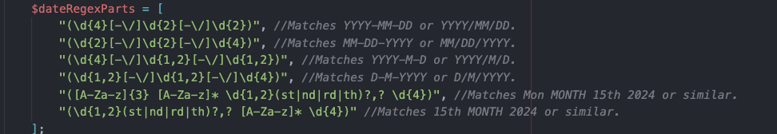
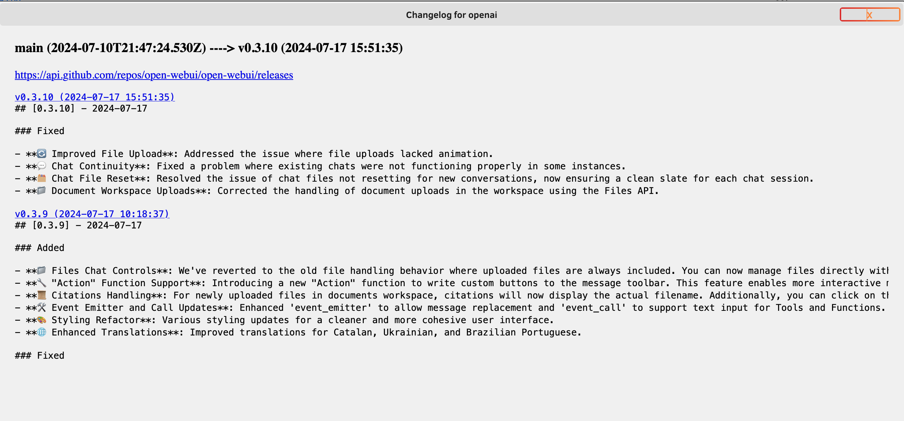
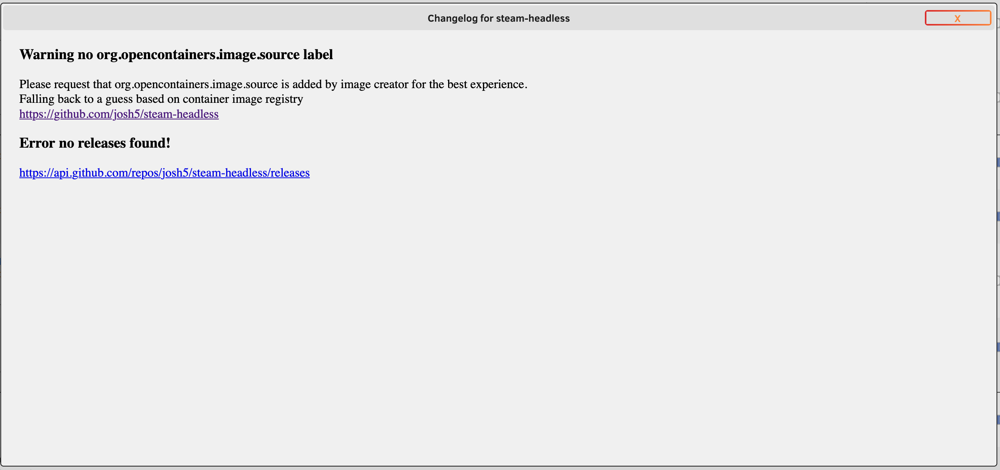
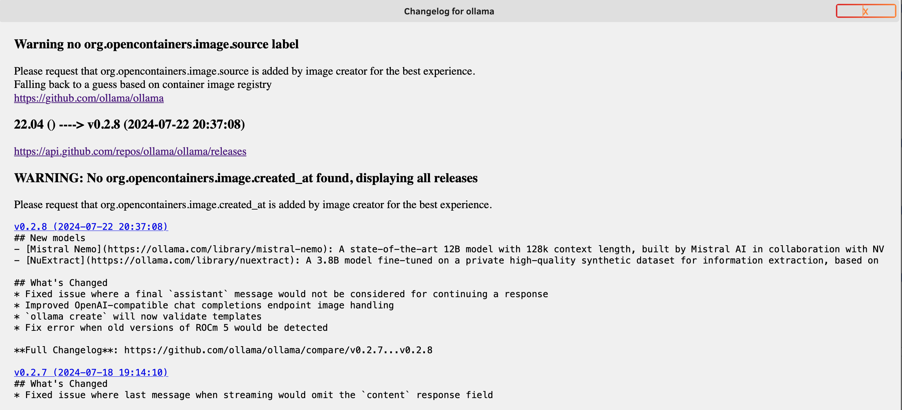
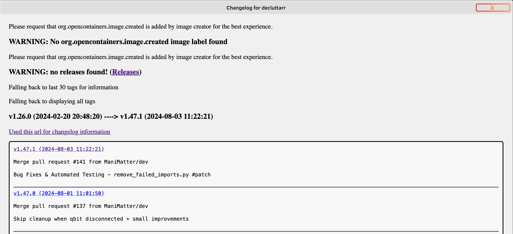
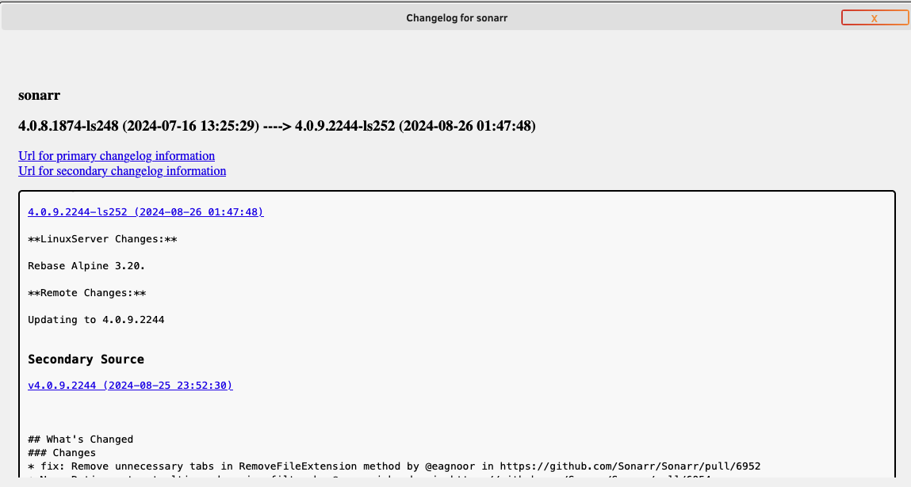
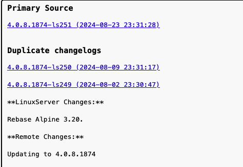

# docker.versions

Install via CA apps in unraid

Unraid plugin to use open container labels to attempt to extract some changelogs when a new version is detected

At the moment github is only supported, happy to support more just need some good examples, The one exception to this is currently for changelog sources.

It should be noted the quality of the changelog is dependent on whatever is posted on the release by the maintainers.

It is highly suggested to generate a github token, this can be set in the settings page for docker.versions and has instructions on this page.

## Flow of release checks

When a container image is checked for release changes the following steps of things occur

* check for opencontainers labels
* If org.opencontainers.image.source is found
  * If docker.versions.imageSourceType is found it will only check that type below
  * Otherwise If the url contains the conditions for a changelog file it will attempt to parse it. note url must contain `.md` or `changelog`
    * this way is experimental and assuming each "version" is denoted with a some sort of date field (feel free to raise issues if you notice a changelog that doesn't work and i can try to see if more flows can be supported)
  * If still nothing it will attempt to check the last 100 github releases
  * If still nothing it will attempt to check the last 100 github tags
    * Note: using tags slows things down alot due to being unable to get the tag message without secondary curl requests
  * If still nothing it fallback to the last 100 github commit messages
* If docker.versions.source is found the above will be followed to collect all secondary releases
* It will then use the org.opencontainers.image.version and org.opencontainers.image.created to filter down the releases to hopefully be the current updatable context
  * It will also attempt to hide duplicated changelogs
  * If the org.opencontainers.image.created is not found it will then attempt to subset to the last 6 months of releases
  * If nothing then it will fallback to displaying everything

## Container Labels

For the best experience images try to add following labels;

| Label                             | Description                                                                                                     |
| --------------------------------- | --------------------------------------------------------------------------------------------------------------- |
| org.opencontainers.image.created  | If missing it will attempt to list the last 6 months of releases found based on type                            |
|                                   | otherwise falls back to all found releases                                                                      |
|                                   |                                                                                                                 |
| org.opencontainers.image.source   | Attempts to use this as the source                                                                              |
|                                   | if missing checks the unraid template for the image registry and attempts a best guess matchup to a github repo |
|                                   |                                                                                                                 |
| org.opencontainers.image.version  | If present will be used as part of the subsetting of releases to be shown                                       |
|                                   | i.e if contains beta then tries to show other beta releases, vice versa exclude them if not found               |
|                                   | Also uses the version to try and filter when a repo may manage multiple projects                                |
|                                   |                                                                                                                 |
| docker.versions.imageSourceType   | If provided this will be used as the only place to check for releases                                           |
|                                   | This can be useful if you want to avoid hitting github for relevant endpoints, or prefer a fallback             |
|                                   | Applies to org.opencontainers.image.source                                                                      |
|                                   | Options include;                                                                                                |
|                                   | changelogs - when set will only be parsed as a changelog, note url must contain `.md` or `changelog`            |
|                                   | releases - when set will only parse releases                                                                    |
|                                   | tags - when set will only parse tags                                                                            |
|                                   | commits - when set will only parse commits                                                                      |
|                                   | disabled - when set it will just skip source entirely                                                           |
|                                   |                                                                                                                 |
| docker.versions.source            | Same as org.opencontainers.image.source                                                                         |
|                                   | but is used to collect a secondary list of releases                                                             |
|                                   | If the primary list fails to find any items then this secondary list is used as the primary                     |
|                                   |                                                                                                                 |
|                                   | This is useful When the container is hosted external to the actual program source                               |
|                                   | example if org.opencontainers.image.source is `https://github.com/linuxserver/docker-sonarr`                    |
|                                   | you can also provide docker.versions.source as`https://github.com/Sonarr/Sonarr`                                |
|                                   | it will do its best to match up a secondary change with a primary change                                        |
|                                   |                                                                                                                 |
|                                   | You can provide this as csv to add additional sources  (Experimental)                                           |
|                                   |                                                                                                                 |
| docker.versions.sourceType        | Same as docker.versions.imageSourceType                                                                         |
|                                   | but applies to docker.versions.source                                                                           |
|                                   | This also works in the same way and is expected to be provided as csv lining up to the source its applicable to |
|                                   |                                                                                                                 |
| docker.versions.tagIgnorePrefixes | csv of terms used exclude certain releases                                                                      |
|                                   | i.e if you provide `apple,banana` if either of these are found in the title of the release it will not be shown |

If a container is missing opencontainers labels suggest to the maintainer to add them
an easy way to implement the labels is via this [github action](https://github.com/docker/metadata-action)
i.e

```yml
-   name: Docker meta
    id: meta
    uses: docker/metadata-action@v5
    with:
        images: ghcr.io/${{ github.repository }}:latest
-   name: Build and push
    uses: docker/build-push-action@v4
    with:
        push: true
        tags: ghcr.io/${{ github.repository }}:latest
        labels: ${{ steps.meta.outputs.labels }}
```

## Changelog matching

Below is the current matching regex's for changelogs


below are a few examples of what can happen

* All Labels


* No labels, no guess


* No labels, successful guess


* No Releases, fallback to using tags


* Using Secondary Source for changelogs


* when duplicated changelogs are detected

